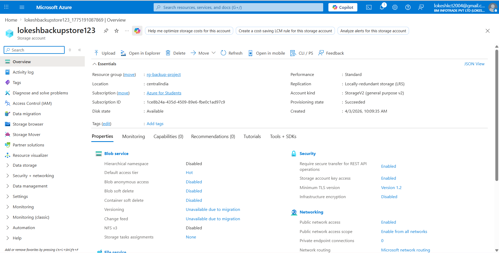
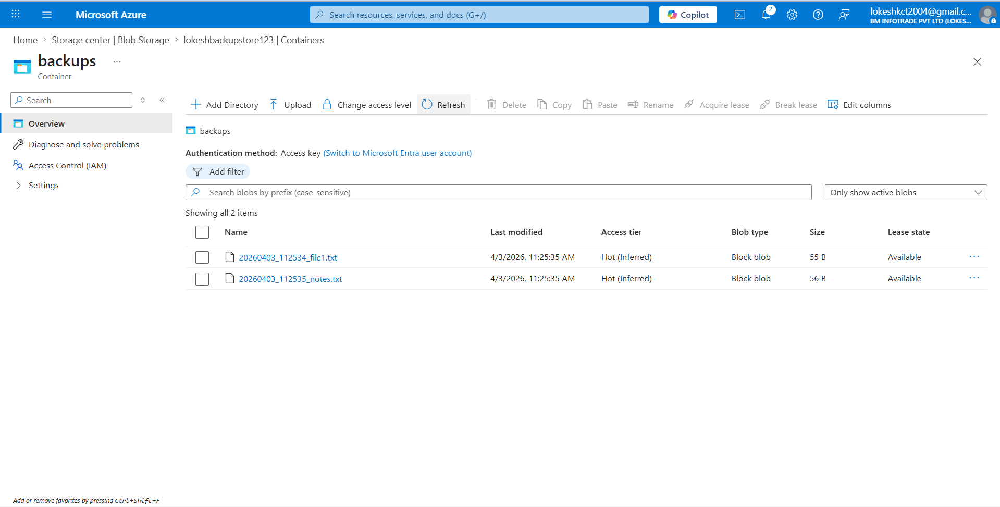
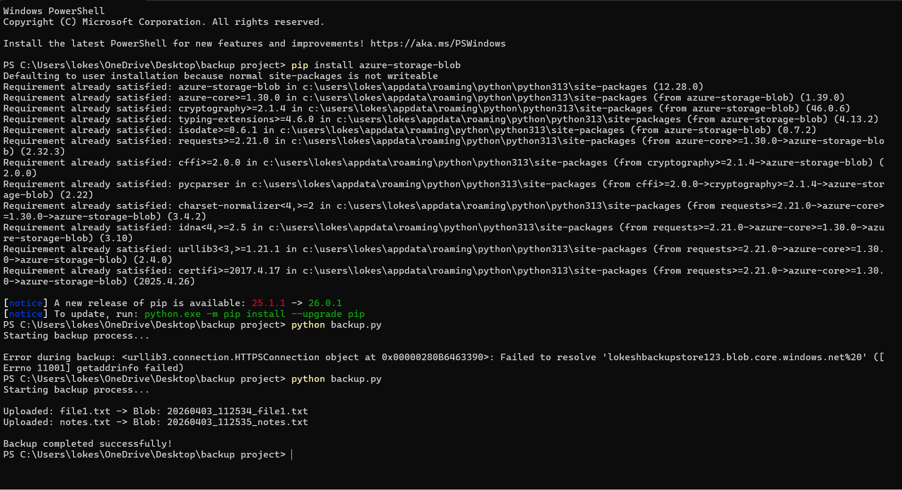
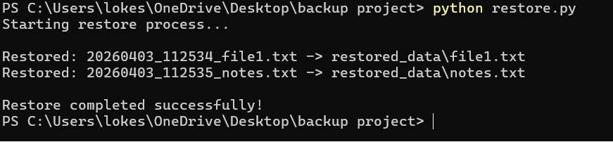
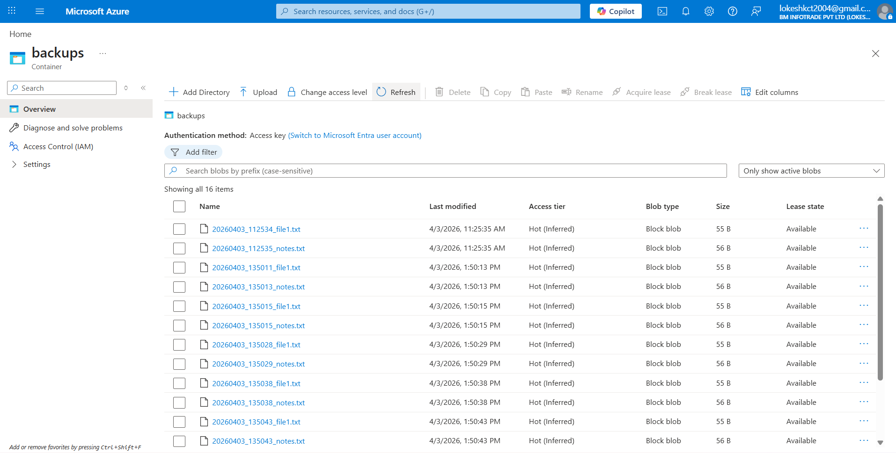
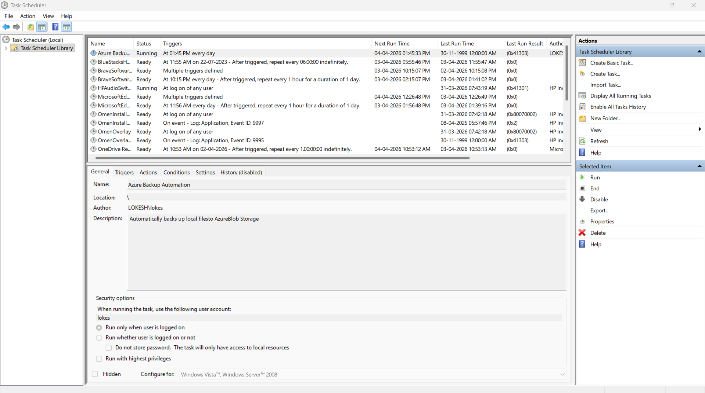

# Cloud Backup & Restore Automation using Azure Blob Storage

## 📌 Project Overview
The **Cloud Backup & Restore Automation** project is a cloud-based solution that automates the process of backing up local files to **Azure Blob Storage** and restoring them when needed. This project demonstrates a simple disaster recovery and backup mechanism using **Python scripts** and **Microsoft Azure**.

The system uploads files from a local folder to Azure cloud storage with **timestamp-based naming**, enabling version-like backup behavior. It also supports restoring files from Azure Blob Storage back to the local system.

---

## 🎯 Objectives
- Automate file backup to the cloud
- Restore files from Azure Blob Storage
- Demonstrate a basic disaster recovery mechanism
- Use Azure cloud services in a practical project
- Create a low-cost and simple backup solution using Azure Student subscription

---

## 🛠️ Technologies Used
- **Microsoft Azure**
  - Azure Storage Account
  - Azure Blob Storage
- **Python 3**
- **Azure Storage Blob SDK for Python**
- **Windows Task Scheduler** *(optional for scheduled automation)*

---

## 🏗️ System Architecture
### Workflow:
1. Local files are stored in the `sample_data/` folder.
2. The `backup.py` script uploads files to **Azure Blob Storage**.
3. Each uploaded file gets a **timestamp-based unique name**.
4. Files are stored in the `backups` container in Azure.
5. The `restore.py` script downloads the backup files from Azure to the `restored_data/` folder.
6. The backup process can be scheduled using **Windows Task Scheduler** for automatic periodic execution.

---

## 📁 Project Structure
```bash
cloud-backup-restore/
├── sample_data/
│   ├── file1.txt
│   └── notes.txt
├── restored_data/
│   ├── file1.txt
│   └── notes.txt
├── screenshots/
│   ├── storage-account.png
│   ├── blob-container.png
│   ├── backup-output.png
│   ├── restore-output.png
│   └── restored-files.png
├── backup.py
├── restore.py
├── requirements.txt
└── README.md

---

## 📸 Project Screenshots

### 1. Azure Storage Account


### 2. Blob Container


### 3. Backup Script Output


### 4. Restore Script Output


### 5. Restored Files in Local Folder


### 6. Task Scheduler (Optional Automation Proof)


---